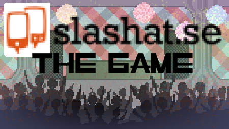
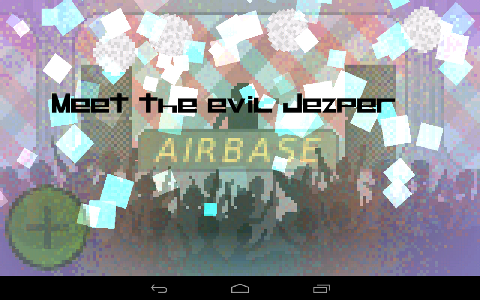
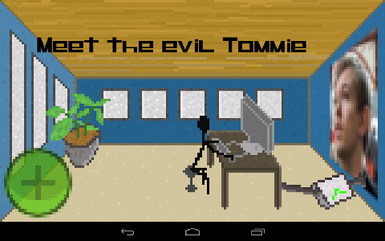

# Slashat: The Game

  

Author: Daniel "MaTachi" Jonsson  
Tools: Eclipse, GIMP, Aseprite  
Development platform: Ubuntu 12.10  
Libraries: LibGDX, Artemis, Universal Tween Engine, Box2D  
Made during March 2013 for One Game A Month

  

## Install on your Android device from Google Play

Slashat: The Game is [available on Google
Play](https://play.google.com/store/apps/details?id=se.danielj.slashatthegame)
for your Android device.

## File formats

* .xcf opens with GIMP.
* [Particle effect](slashat-the-game-android/assets/effects) opens with
  LibGDX's [Particle
Editor](https://code.google.com/p/libgdx/wiki/ParticleEditor).
* .ase opens with Aseprite.

## Licenses

The code I have written is licensed under [GNU GPLv3](LICENSE.txt). The images
I have made, which are all in [images/](images/), [images-dev/](images-dev/)
and [blog/](blog/) except the Slashat logo and photo of Tommie, are licensed
under Creative Commons Attribution-ShareAlike 3.0 Unported ([CC BY-SA
3.0](http://creativecommons.org/licenses/by-sa/3.0/)). The [particle
effects](slashat-the-game-android/assets/effects/) are also made by me and are
licensed under CC BY-SA 3.0.

LibGDX is available under Apache License 2.0
[[link](https://code.google.com/p/libgdx/)].  
Artemis is available under New BSD License.
[[link](http://gamadu.com/artemis/)].  
Box2D is available under zlib License. [[link](http://box2d.org/about/)].  
Universal Tween Engine is available under Apache License 2.0
[[link](https://code.google.com/p/java-universal-tween-engine/)].

The fonts being used are [Rase
GPL](http://openfontlibrary.org/en/font/rase-gpl) and
[EptKazoo](http://openfontlibrary.org/en/font/eptkazoo) which are licensed
under [SIL Open Font
License](http://scripts.sil.org/cms/scripts/page.php?site_id=nrsi&id=OFL).

Music being used:
* [Theme Music by Alexandr Zhelanov](http://opengameart.org/content/theme-menu)
  licensed under CC BY 3.0.
* [Dissonant Waltz by Yubatake](http://opengameart.org/content/dissonant-waltz)
  licensed under CC BY 3.0.
* [Below The Shift by
  Clearside](http://opengameart.org/content/dark-electronic-rock-clearside-nin-style)
licensed under CC BY-SA 3.0.

Explosion sound effect:
* [Explode by Michel
  Barabari](http://opengameart.org/content/2-high-quality-explosions) licensed
under CC BY 3.0.

## Texture packer

    rm slashat-the-game-android/assets/sprites/sprites.{atlas,png} ; java -classpath slashat-the-game/libs/gdx.jar:slashat-the-game/libs/gdx-tools.jar com.badlogic.gdx.tools.imagepacker.TexturePacker2 images slashat-the-game-android/assets/sprites sprites

